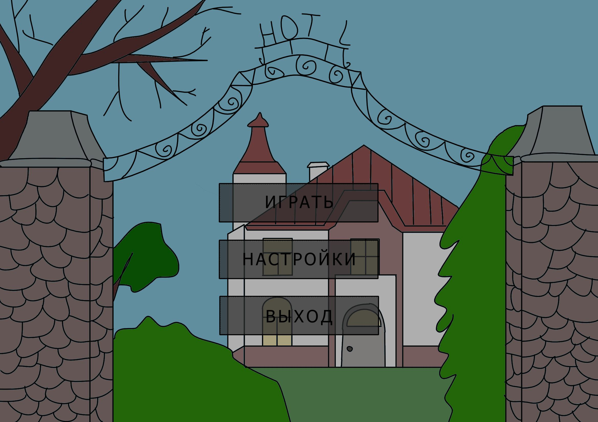
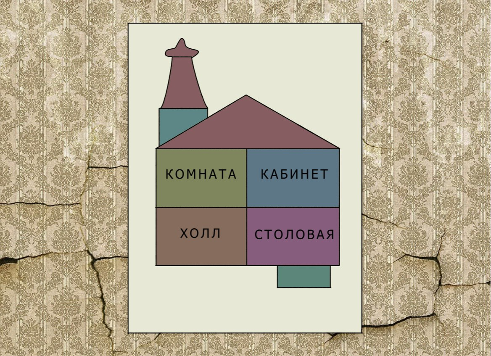
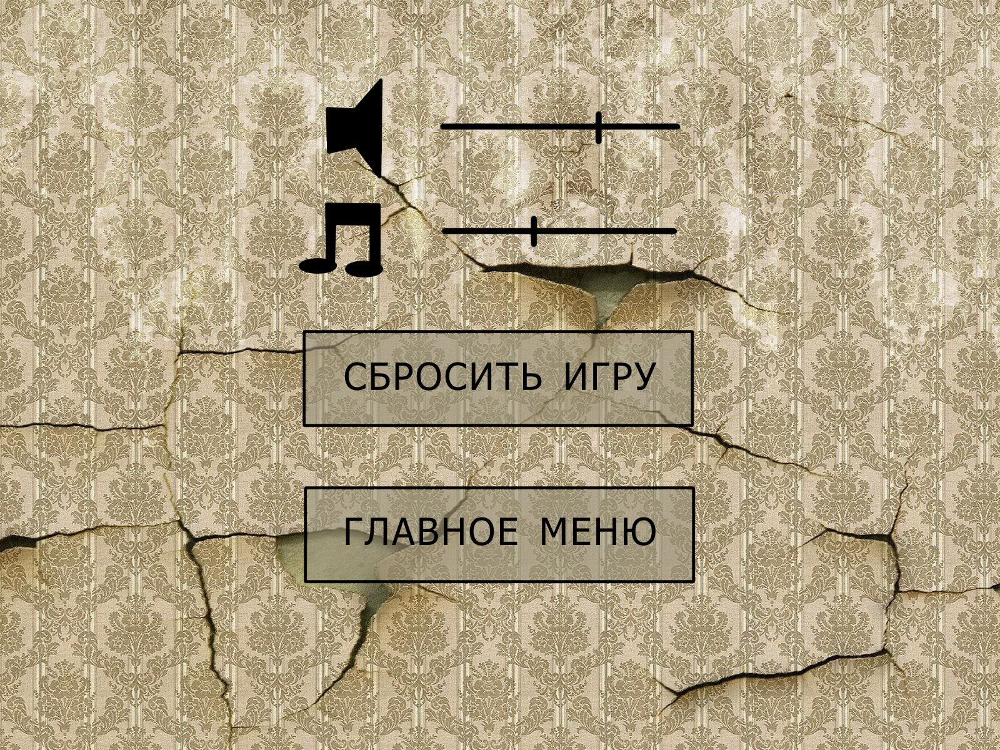

В папке documents находятся требования к проекту и мокапы в формате pdf.  
  
# Сингл-игра Тайны Хартс
---

# Содержание

1. [Введение](#intro)  
   1.1 [Назначение](#appointment)  
   1.2 [Бизнес-требования](#business_requirements)  
   1.2.1 [Исходные данные](#initial_data)  
   1.2.2 [Сюжет и атмосфера](#plot_atmosphere)  
   1.2.3 [Графика и дизайн](#graphics_design)  
   1.2.4 [Геймплей](#gamepla)  
   1.2.5 [Звуковое сопровождение](#sound_accompaniment)  
   1.3 [Аналоги](#analogues)  
   1.3.1 [Samsara Room](#samsara_room)  
   1.3.2 [Cube Escape Collection](#cube_escape_collection)  
2. [Требования пользователя](#user_requirements)  
   2.1 [Программные интерфейсы](#software_interfaces)  
   2.2 [Интерфейс пользователя](#user_interface)  
   2.3 [Характеристики пользователей](#user_specifications)  
   2.3.1 [Целевая аудитория](#target_audience)  
   2.4 [Предположения и зависимости](#assumptions_and_dependencies)
3. [Системные требования](#system_requirements)  
   3.1 [Функциональные требования](#functional_requirements)  
   3.1.1 [Основные функции](#main_functions)  
   3.1.1.1 [Играть](#play)  
   3.1.1.2 [Настройка параметров игры](#settings)  
   3.1.1.3 [Сохранение игры](#save_game)  
   3.1.2 [Ограничения и исключения](#restrictions_and_exclusions)  
   3.2 [Нефункциональные требования](#non-functional_requirements)  
   3.2.1 [Атрибуты качества](#quality_attributes)  
   3.2.1.1 [Графика и атмосфера](#graphics_and_atmosphere)  
   3.2.2 [Ограничения](#restrictions)

# 1 Введение

## 1.1 Назначение

Тайны Харст – это инди-игра в жанре графического квеста. По стилистике и геймплею проект напоминает игры “Cube Escape”, “Samsara Room” и др. Игрок попадает в заброшенный отель “Харст”, где ему предстоит разобраться что происходит и выбраться из отеля.

<a name="business_requirements"/>

## 1.2 Бизнес-требования

<a name="initial_data"/>

### 1.2.1 Исходные данные

“Тайны Харст” даёт игроку возможность ощутить себя в своеобразной роли ищейки, прочувствовать атмосферу заброшенного отеля, пошагово раскрывая его тайны и загадки.

<a name="plot_atmosphere"/>

### 1.2.2 Сюжет и атмосфера

Игра "Тайны Харст" предлагает игроку погрузиться в захватывающий и загадочный мир заброшенного отеля "Харст". Сюжет обогащен многочисленными тайнами и головоломками, атмосфера наполнена ощущением одиночества, тайны и неопределенности.

<a name="graphics_design"/>

### 1.2.3 Графика и дизайн

Графический стиль игры вдохновлен работами "Cube Escape" и "Samsara Room". Игра предлагает игроку уникальный визуальный опыт, с проработанными деталями и декорациями отеля "Харст". Графика и дизайн помогают создать мрачную и загадочную атмосферу.

<a name="gamepla"/>

### 1.2.4 Геймплей

Игра представляет собой графический квест с элементами головоломок. Игроку предстоит расследовать комнаты отеля, собирать предметы, решать головоломки и разгадывать тайны, чтобы понять, что произошло в "Харст" и как выбраться оттуда. Геймплей способствует развитию логического мышления и чувства исследования.

<a name="sound_accompaniment"/>

### 1.2.5 Звуковое сопровождение

Атмосфера игры усиливается звуковым сопровождением, которое подчеркивает мистический характер отеля "Харст". Звуки скрипящих дверей, шорохи в темных углах и мелодичная музыка создают неповторимое впечатление.

<a name="analogues"/>

## 1.3 Аналоги

<a name="samsara_room"/>

## 1.3.1 Samsara Room

**Страница в Steam:** https://store.steampowered.com/app/1281800/Samsara_Room/  
**Русский интерфейс:** есть

Samsara Room — это новое атмосферное приключение в жанре point-and-click. Вы очнулись в странной комнате с напольными часами, телефоном, зеркалом и необычными предметами, которые вам ни о чем не говорят. Похоже, есть только один путь на свободу... достичь просвещения

<a name="cube_escape_collection"/>

## 1.3.2 Cube Escape Collection
**Страница в Steam:** https://store.steampowered.com/app/1292940/Cube_Escape_Collection/
**Русский интерфейс:** есть

<a name="user_requirements"/>

# 2 Требования пользователя

<a name="software_interfaces"/>

## 2.1 Программные интерфейсы

Составляющие проекта:
Игра будет писаться на движке Adobe Flash. Весь арт в игре будет 2д.

<a name="user_interface"/>

## 2.2 Интерфейс пользователя

Главное меню игры.

В главном меню есть 3 кнопки:
1.	При нажатии на кнопку "ИГРАТЬ" запускается карта с выбором уровня
2.	При нажатии на кнопку "НАСТРОЙКИ" игрок преходит в настройки игры.
3.	При нажатии на кнопку "ВЫХОД" окно игры закрывается

После нажатия на кнопку “ИГРАТЬ” пользователь может выбрать уровень

После выбора уровня начинается сам игровой процесс.

После нажатия на кнопку “НАСТРОЙКИ” пользователю высветятся изменяемые параметры.

1.	Ползунок с микшером – изменить громкость звуков
2.	Ползунок с нотой – изменить громкость музыки 
3.	Кнопка “СБРОСИТЬ ИГРУ” – сбросить прогресс до первого уровня
4.	Кнопка “ГЛАВНОЕ МЕНЮ” – вернуться в главное меню
<a name="user_specifications"/>

## 2.3 Характеристики пользователей

<a name="target_audience"/>

### 2.3.1 Целевая аудитория

Целевая аудитория проекта включает в себя взрослых и подростков, предпочитающих головоломки и квесты, а также тех, кто интересуется мистикой, психологическими загадками и атмосферными играми. Игра больше ориентирована на более зрелую аудиторию из-за своего загадочного сюжета, темной атмосферы и взрослых тем.

<a name="assumptions_and_dependencies"/>

## 2.4 Предположения и зависимости

Требования к системе могут меняться в зависимости от уровня оптимизации, размера игры и количества уникального контента.

<a name="system_requirements"/>

# 3 Системные требования

<a name="functional_requirements"/>

## 3.1 Функциональные требования

<a name="main_functions"/>

### 3.1.1 Основные функции

<a name="play"/>

#### 3.1.1.1 Играть

**Описание.** Пользователь имеет возможность выбрать на карте уровень, который он хочет пройти. С прохождение каждого уровня, будут открываться новые. 

<a name="settings"/>

#### 3.1.1.2 Настройка параметров игры

**Описание.** Пользователь имеет возможность редактировать настройки игры.

| Функция | Требования | 
|:---|:---|
| изменение громкости музыки | Пользователь имеет возможность изменять относительный уровень громкости музыки в игре. |
| изменение громкости звуковых эффектов | Пользователь имеет возможность изменять относительный уровень громкости звуковых эффектов в игре. |
| сброс прогресса | Пользователь имеет возможность сбросить весь прогресс и заблокировать все уровни, кроме первого. |

<a name="save_game"/>

#### 3.1.1.3 Сохранение игры

**Описание.** После прохождения уровня будет открываться новый уровень, прогресс уровней сохраняется.

<a name="restrictions_and_exclusions"/>

### 3.1.2 Ограничения и исключения

1. Игра будет корректно работать если характеристики ПК совпадают или лучше чем системные требования игры.

<a name="non-functional_requirements"/>

## 3.2 Нефункциональные требования

<a name="quality_attributes"/>

### 3.2.1 Атрибуты качества

<a name="graphics_and_atmosphere"/>

#### 3.2.1.1 Графика и атмосфера

Важно, чтобы игра имела качественную и привлекательную графику, которая создает уникальную атмосферу мрачного и загадочного отеля Хартс. Это может включать в себя детализацию комнат, эффекты, арт-стиль, соответствующий тематике игры, звуковое сопровождение.

<a name="restrictions"/>

### 3.2.2 Ограничения

1. Приложение реализовано на движке Unreal Engine 4;
2. Все сохранения хранятся локально в виде JSON файлов .
